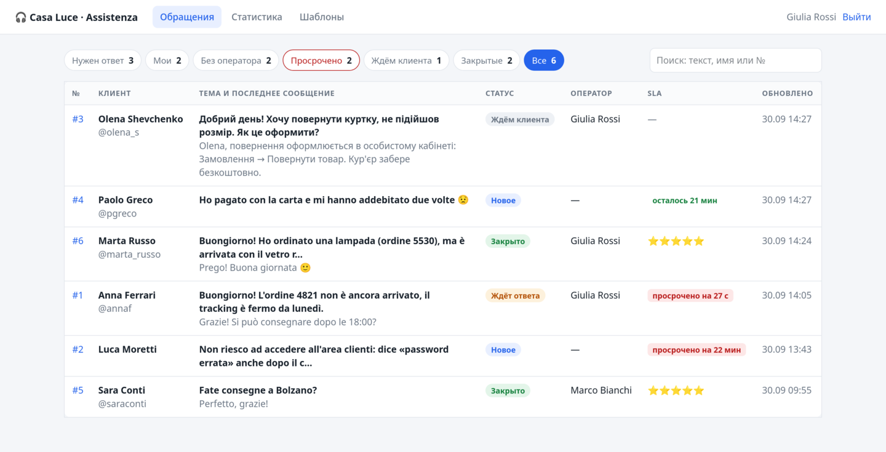
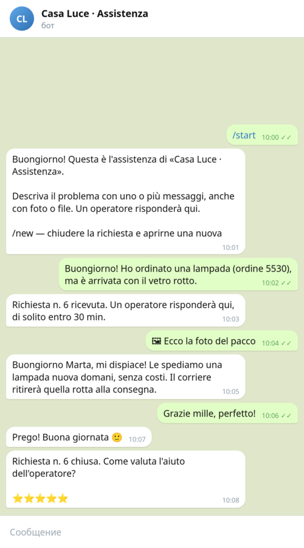

# 🎧 Support Desk

<p>
  <a href="https://github.com/sonoyumi/support-desk/actions/workflows/ci.yml"></a>
  
  
  
  
</p>

**🇬🇧 [English](#en)** · **🇮🇹 [Italiano](#it)** · **🇺🇦 [Українська](#uk)** · **🇷🇺 [Русский](#ru)**

<p align="center">
  
  
</p>

---

<a id="en"></a>

## 🇬🇧 English

A customer support desk on Telegram. Customers write to the company's bot — text, photos, files; every conversation
becomes a ticket. Operators answer from a web panel in the browser, and the answer arrives in the customer's chat.
Statuses, assignment, a first-reply SLA, canned replies, internal notes, full-text search, reliable delivery and a
5-star rating after closing. The bot speaks Italian, English, Ukrainian or Russian — the customer's Telegram language.

```
customer ── Telegram ──► bot ──► SQLite: customer · ticket · message ──► panel (FastAPI): list, SLA, search
                          │ «Request #6 received»                              │ operator replies
                          ▼                                                    ▼
                 operators' chat: 🆕 / ⏰ SLA          delivery queue (outbox) ── retries ──► customer's chat
                                                               └─ blocked the bot? ✕ failed + «retry» in the panel
```

### Features

- **Tickets from chats:** a customer has one active ticket; follow-up messages join it; a message after closing opens
  a new one (a partial UNIQUE index guarantees it). Photos, files, voice and video are filed with their Telegram id.
- **Statuses:** new → waiting for the customer (after our reply) → the customer answered again → closed (by an operator,
  by the customer with `/new` or automatically after 48 h of silence).
- **SLA:** a timer for every ticket that needs a reply; «X min left» / «overdue by X» in the list, an «Overdue» tab and
  one alert in the operators' Telegram chat.
- **Panel:** tabs with counters (needs reply, mine, unassigned, overdue, waiting, closed, all), full-text search over
  the conversation (SQLite FTS5, accents ignored, `#12` finds a ticket), assignment, internal notes the customer
  never sees, canned replies with `{name}`, `{ticket}`, `{operator}`, reply-and-close, reopen, auto-refresh.
- **Reliable delivery:** replies are stored first and sent by a separate loop: retries with backoff and jitter,
  Telegram's `retry_after` obeyed, a lease returns a crashed send to the queue, «blocked the bot» is marked as failed
  with a retry button.
- **Ratings and stats:** ⭐1–5 buttons after closing (once, only by the ticket's customer); average first reply, share
  within SLA, CSAT, per-operator numbers — on the page and with `support-desk stats`.
- **Security:** scrypt passwords, HMAC-signed session cookie (HttpOnly, SameSite), CSRF token in every form, 5 failed
  logins → 5-minute pause, strict CSP (no inline scripts), every customer text escaped.
- **CLI:** `run`, `web`, `add-operator`, `passwd`, `canned-defaults`, `stats`, `check`, `demo`.

### Example

```bash
support-desk stats
```

```
За 30 дн.: новых обращений 6, с ответом 4
Сейчас: новое 2 · ждёт ответа 1 · ждём клиента 1 · закрыто 2
Первый ответ в среднем: 10.8 мин · в пределах SLA (30 мин): 100.0%
Оценки: 100.0% довольны, средняя 5.0
  Giulia Rossi         ответов    4 · обращений   3
  Marco Bianchi        ответов    1 · обращений   1
⚠️  Не доставлено ответов: 1 (клиент заблокировал бота?)
```

Real output on the demo data (`support-desk demo` + one customer through the real bot). In English: 6 new tickets,
4 answered; the first reply takes 10.8 min on average, 100 % within the 30-minute SLA; everyone rated 5; one reply
could not be delivered because the customer blocked the bot.

### Quick start

```bash
git clone https://github.com/sonoyumi/support-desk.git
cd support-desk
python3 -m venv .venv && source .venv/bin/activate
pip install -e ".[dev]"
cp .env.example .env                      # BOT_TOKEN, SECRET_KEY, OPERATORS_CHAT_ID
support-desk add-operator giulia --name "Giulia Rossi" --admin
support-desk canned-defaults
support-desk run                          # bot + panel on http://127.0.0.1:8096
```

Just to look around without a bot: `support-desk demo && support-desk web`, login `giulia` / `demo-password-123`.

Tests: `pytest` (61 tests: passwords, sessions and CSRF, the ticket life cycle, one active ticket per customer, ratings,
the delivery queue with leases, retries, `retry_after` and blocked bots, full-text search and injection-safe queries,
SLA alerts and auto-close, statistics, the bot through the real aiogram Dispatcher in four languages, and the panel
end to end: login limits, open redirects, escaping, CSRF, every action). No network or Telegram token needed.

### Project structure

```
src/support_desk/
├── config.py     # settings from .env, every error at once
├── security.py   # scrypt passwords, signed session cookie, CSRF tokens
├── store.py      # SQLite: tickets, messages, delivery queue, search (FTS5), SLA, stats
├── bot.py        # the customer's side: aiogram router, tickets from messages, rating buttons
├── sender.py     # delivery loop with retries; SLA alerts and auto-close
├── texts.py      # bot texts in 4 languages, time and SLA helpers
├── web.py        # operators' panel: FastAPI + Jinja2
├── templates/    # tickets, ticket, stats, canned replies, login
├── static/       # style.css, app.js (row links, canned replies, auto-refresh)
└── cli.py        # run | web | add-operator | passwd | canned-defaults | stats | check | demo
```

### Author

**Vladyslav Shokun** ([@sonoyumi](https://github.com/sonoyumi)), Python developer: Telegram bots, web scraping, automation.

[](https://t.me/sonoyumiii)
[](mailto:sonoyumiii@gmail.com)

> 💼 Customers write to you in Telegram and answers get lost? I'll set up a support desk like this for your team.

### License

MIT, see [LICENSE](LICENSE).

---

<a id="it"></a>

## 🇮🇹 Italiano

**[🇬🇧 English](#en)** · **🇮🇹 Italiano** · **[🇺🇦 Українська](#uk)** · **[🇷🇺 Русский](#ru)**

Assistenza clienti su Telegram. I clienti scrivono al bot dell'azienda — testo, foto, file — e ogni conversazione
diventa una richiesta. Gli operatori rispondono da un pannello web nel browser e la risposta arriva nella chat del
cliente. Stati, assegnazione, SLA sulla prima risposta, risposte pronte, note interne, ricerca, consegna affidabile e
valutazione a 5 stelle dopo la chiusura. Il bot parla italiano, inglese, ucraino o russo, secondo la lingua di Telegram
del cliente.

### Funzionalità

- **Richieste dalle chat:** una richiesta attiva per cliente, i messaggi successivi si aggiungono; dopo la chiusura se ne
  apre una nuova. Foto, file, vocali e video vengono salvati con il loro id Telegram.
- **Stati:** nuova → in attesa del cliente → il cliente ha risposto → chiusa (dall'operatore, dal cliente con `/new` o
  automaticamente dopo 48 ore di silenzio).
- **SLA:** «mancano X min» / «in ritardo di X» nell'elenco, scheda «In ritardo» e un avviso nella chat degli operatori.
- **Pannello:** schede con contatori, ricerca nel testo (SQLite FTS5, accenti ignorati, `#12` trova la richiesta),
  assegnazione, note interne invisibili al cliente, risposte pronte con `{name}`, `{ticket}`, `{operator}`,
  «invia e chiudi», riapertura, aggiornamento automatico.
- **Consegna affidabile:** le risposte vengono salvate e poi inviate con nuovi tentativi; se il cliente ha bloccato il
  bot, il pannello lo mostra con il pulsante «riprova».
- **Valutazioni e statistiche:** pulsanti ⭐1–5; tempo medio della prima risposta, quota entro lo SLA, soddisfazione,
  numeri per operatore.
- **Sicurezza:** password scrypt, cookie di sessione firmato, token CSRF in ogni modulo, limite ai tentativi di accesso,
  CSP rigorosa, ogni testo del cliente viene «escapato».

### Esempio

L'output di `support-desk stats` è nella sezione inglese: 6 richieste, prima risposta in media in 10,8 minuti, 100 %
entro lo SLA di 30 minuti, tutti hanno dato 5 stelle, una risposta non consegnata perché il cliente ha bloccato il bot.

### Avvio rapido

```bash
git clone https://github.com/sonoyumi/support-desk.git
cd support-desk
python3 -m venv .venv && source .venv/bin/activate
pip install -e ".[dev]"
cp .env.example .env                      # BOT_TOKEN, SECRET_KEY, OPERATORS_CHAT_ID
support-desk add-operator giulia --name "Giulia Rossi" --admin
support-desk canned-defaults
support-desk run                          # bot + pannello su http://127.0.0.1:8096
```

Solo per vedere il pannello senza bot: `support-desk demo && support-desk web`, accesso `giulia` / `demo-password-123`.
Test: `pytest` (61 test, senza rete né token Telegram).

### Struttura del progetto

```
src/support_desk/
├── config.py     # impostazioni da .env
├── security.py   # password, cookie di sessione, CSRF
├── store.py      # SQLite: richieste, messaggi, coda di consegna, ricerca, SLA, statistiche
├── bot.py        # lato cliente: bot aiogram, pulsanti di valutazione
├── sender.py     # consegna con nuovi tentativi; avvisi SLA e chiusura automatica
├── texts.py      # testi del bot in 4 lingue
├── web.py        # pannello operatori: FastAPI + Jinja2
├── templates/ static/
└── cli.py        # run | web | add-operator | passwd | canned-defaults | stats | check | demo
```

### Autore

**Vladyslav Shokun** ([@sonoyumi](https://github.com/sonoyumi)), sviluppatore Python: bot Telegram, web scraping, automazione.

[](https://t.me/sonoyumiii)
[](mailto:sonoyumiii@gmail.com)

> 💼 I clienti vi scrivono su Telegram e le risposte si perdono? Preparo un'assistenza come questa per il vostro team.

### Licenza

MIT, vedi [LICENSE](LICENSE).

---

<a id="uk"></a>

## 🇺🇦 Українська

**[🇬🇧 English](#en)** · **[🇮🇹 Italiano](#it)** · **🇺🇦 Українська** · **[🇷🇺 Русский](#ru)**

Служба підтримки клієнтів у Telegram. Клієнти пишуть боту компанії — текст, фото, файли, і кожна розмова стає
зверненням. Оператори відповідають із вебпанелі в браузері, а відповідь приходить клієнту в чат. Статуси, призначення,
SLA першої відповіді, шаблони, внутрішні нотатки, пошук, надійна доставка й оцінка в 5 зірок після закриття. Бот
говорить італійською, англійською, українською чи російською — мовою Telegram клієнта.

### Можливості

- **Звернення з чатів:** одне активне звернення на клієнта, наступні повідомлення додаються до нього; після закриття
  відкривається нове. Фото, файли, голосові й відео зберігаються з їхнім id у Telegram.
- **Статуси:** нове → чекаємо клієнта → клієнт відповів → закрито (оператором, клієнтом через `/new` або автоматично
  після 48 год тиші).
- **SLA:** «лишилося X хв» / «прострочено на X» у списку, вкладка «Прострочено» й одне сповіщення в чат операторів.
- **Панель:** вкладки з лічильниками, повнотекстовий пошук (SQLite FTS5, `#12` знаходить звернення), призначення,
  нотатки, яких клієнт не бачить, шаблони з `{name}`, `{ticket}`, `{operator}`, «надіслати й закрити», автооновлення.
- **Надійна доставка:** відповіді спершу зберігаються, потім надсилаються з повторами; якщо клієнт заблокував бота,
  панель показує це й кнопку «повторити».
- **Оцінки та статистика:** кнопки ⭐1–5; середній час першої відповіді, частка в межах SLA, задоволеність, цифри
  по операторах.
- **Безпека:** паролі scrypt, підписаний cookie сесії, CSRF-токен у кожній формі, ліміт спроб входу, сувора CSP,
  екранування кожного тексту клієнта.

### Приклад

Вивід `support-desk stats` — в англійському розділі: 6 звернень, перша відповідь у середньому за 10,8 хв, 100 % у
межах SLA 30 хв, усі поставили 5 зірок, одну відповідь не доставлено, бо клієнт заблокував бота.

### Швидкий старт

```bash
git clone https://github.com/sonoyumi/support-desk.git
cd support-desk
python3 -m venv .venv && source .venv/bin/activate
pip install -e ".[dev]"
cp .env.example .env                      # BOT_TOKEN, SECRET_KEY, OPERATORS_CHAT_ID
support-desk add-operator giulia --name "Giulia Rossi" --admin
support-desk canned-defaults
support-desk run                          # бот + панель на http://127.0.0.1:8096
```

Лише подивитися панель без бота: `support-desk demo && support-desk web`, вхід `giulia` / `demo-password-123`.
Тести: `pytest` (61 тест, без мережі й токена Telegram).

### Структура проєкту

```
src/support_desk/
├── config.py     # налаштування з .env
├── security.py   # паролі, cookie сесії, CSRF
├── store.py      # SQLite: звернення, повідомлення, черга доставки, пошук, SLA, статистика
├── bot.py        # бік клієнта: бот на aiogram, кнопки оцінки
├── sender.py     # доставка з повторами; сповіщення SLA й автозакриття
├── texts.py      # тексти бота 4 мовами
├── web.py        # панель операторів: FastAPI + Jinja2
├── templates/ static/
└── cli.py        # run | web | add-operator | passwd | canned-defaults | stats | check | demo
```

### Автор

**Vladyslav Shokun** ([@sonoyumi](https://github.com/sonoyumi)), Python-розробник: Telegram-боти, вебскрапінг, автоматизація.

[](https://t.me/sonoyumiii)
[](mailto:sonoyumiii@gmail.com)

> 💼 Клієнти пишуть вам у Telegram, а відповіді губляться? Налаштую таку підтримку для вашої команди.

### Ліцензія

MIT, див. [LICENSE](LICENSE).

---

<a id="ru"></a>

## 🇷🇺 Русский

**[🇬🇧 English](#en)** · **[🇮🇹 Italiano](#it)** · **[🇺🇦 Українська](#uk)** · **🇷🇺 Русский**

Служба поддержки клиентов в Telegram. Клиенты пишут боту компании — текст, фото, файлы, и каждый разговор становится
обращением. Операторы отвечают из веб-панели в браузере, а ответ приходит клиенту в чат. Статусы, назначение, SLA
первого ответа, шаблоны, внутренние заметки, поиск, надёжная доставка и оценка в 5 звёзд после закрытия. Бот говорит
по-итальянски, по-английски, по-украински или по-русски — на языке Telegram клиента.

### Возможности

- **Обращения из чатов:** одно активное обращение на клиента, следующие сообщения добавляются к нему; после закрытия
  открывается новое (гарантирует частичный UNIQUE-индекс). Фото, файлы, голосовые и видео сохраняются с их id в Telegram.
- **Статусы:** новое → ждём клиента (после нашего ответа) → клиент ответил → закрыто (оператором, клиентом через `/new`
  или автоматически после 48 ч тишины).
- **SLA:** «осталось X мин» / «просрочено на X» в списке, вкладка «Просрочено» и одно уведомление в чат операторов.
- **Панель:** вкладки со счётчиками, полнотекстовый поиск (SQLite FTS5, акценты не важны, `#12` находит обращение),
  назначение, заметки, которых клиент не видит, шаблоны с `{name}`, `{ticket}`, `{operator}`, «отправить и закрыть»,
  повторное открытие, автообновление.
- **Надёжная доставка:** ответы сначала сохраняются, потом отправляются отдельным циклом с повторами, паузой и
  разбросом; `retry_after` от Telegram соблюдается; если клиент заблокировал бота — в панели «✕» и кнопка «повторить».
- **Оценки и статистика:** кнопки ⭐1–5 (один раз и только своему клиенту); среднее время первого ответа, доля в
  пределах SLA, довольные клиенты, цифры по операторам — на странице и в `support-desk stats`.
- **Безопасность:** пароли scrypt, подписанный cookie сессии (HttpOnly, SameSite), CSRF-токен в каждой форме,
  5 неудачных входов → пауза 5 минут, строгая CSP (без встроенных скриптов), экранирование любого текста клиента.
- **Командная строка:** `run`, `web`, `add-operator`, `passwd`, `canned-defaults`, `stats`, `check`, `demo`.

### Пример

Вывод `support-desk stats` на демо-данных — в английском разделе: 6 обращений, первый ответ в среднем за 10,8 мин,
100 % в пределах SLA 30 мин, все поставили 5 звёзд, один ответ не доставлен — клиент заблокировал бота.

### Быстрый старт

```bash
git clone https://github.com/sonoyumi/support-desk.git
cd support-desk
python3 -m venv .venv && source .venv/bin/activate
pip install -e ".[dev]"
cp .env.example .env                      # BOT_TOKEN, SECRET_KEY, OPERATORS_CHAT_ID
support-desk add-operator giulia --name "Giulia Rossi" --admin
support-desk canned-defaults
support-desk run                          # бот + панель на http://127.0.0.1:8096
```

Только посмотреть панель без бота: `support-desk demo && support-desk web`, вход `giulia` / `demo-password-123`.
Тесты: `pytest` (61 тест, без сети и токена Telegram).

### Структура проекта

```
src/support_desk/
├── config.py     # настройки из .env, все ошибки сразу
├── security.py   # пароли scrypt, подписанный cookie, CSRF-токены
├── store.py      # SQLite: обращения, сообщения, очередь доставки, поиск FTS5, SLA, статистика
├── bot.py        # сторона клиента: роутер aiogram, обращения из сообщений, кнопки оценки
├── sender.py     # цикл доставки с повторами; уведомления SLA и автозакрытие
├── texts.py      # тексты бота на 4 языках, время и SLA
├── web.py        # панель операторов: FastAPI + Jinja2
├── templates/    # список, обращение, статистика, шаблоны, вход
├── static/       # style.css, app.js
└── cli.py        # run | web | add-operator | passwd | canned-defaults | stats | check | demo
```

### Автор

**Vladyslav Shokun** ([@sonoyumi](https://github.com/sonoyumi)), Python-разработчик: Telegram-боты, веб-скрапинг, автоматизация.

[](https://t.me/sonoyumiii)
[](mailto:sonoyumiii@gmail.com)

> 💼 Клиенты пишут вам в Telegram, а ответы теряются? Настрою такую поддержку для вашей команды.

### Лицензия

MIT, см. [LICENSE](LICENSE).
